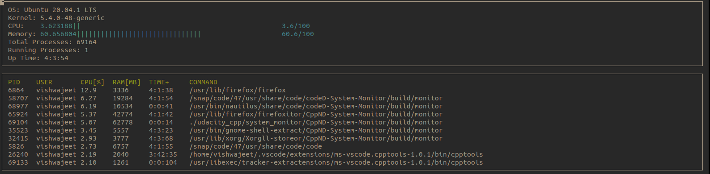

# System Monitor for Linux
# Author : Vishwajeet Karmarkar
# Email : vishwajeet@u.northwestern.edu

This is a system monitor built for the Udacity C++ Nanodegree <br>




To use the monitor clone the repo:

```
git clone https://github.com/vishwajeet-NU/system_monitor-udacity.git
```

To build the project : 

```
make build
```

To clean old build files : 

``` 
make clean
```

To run the monitor: 

```
./build/monitor

```


